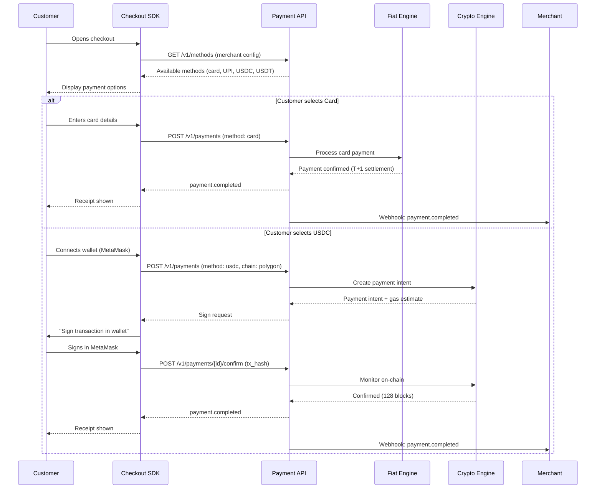
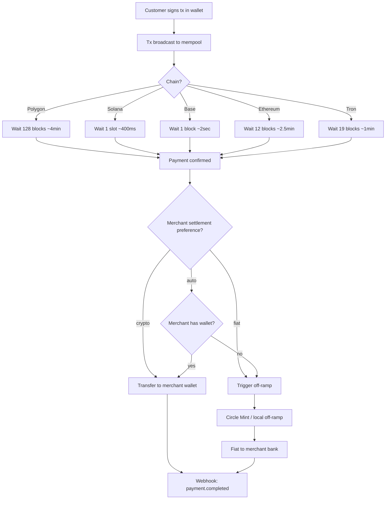
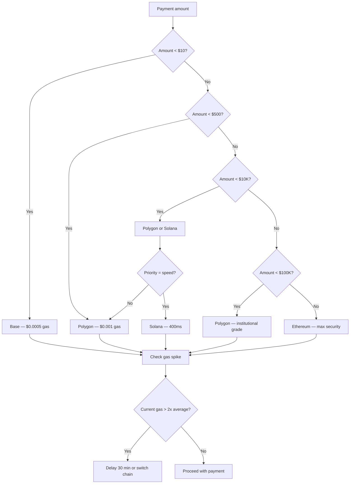
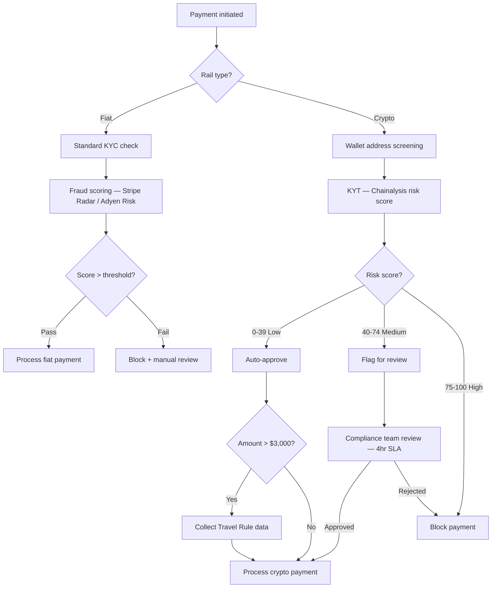
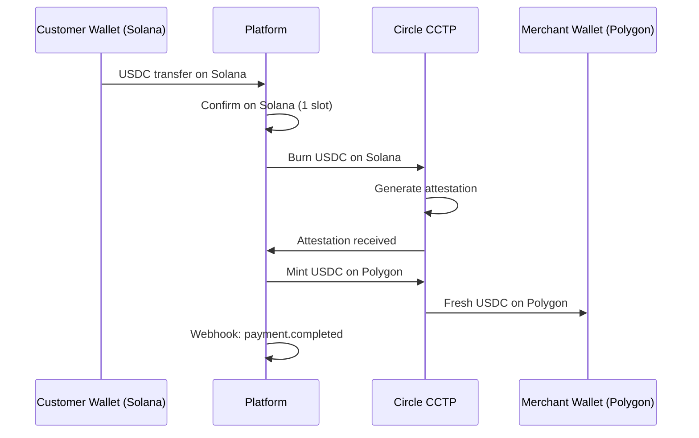

# Payment Flow Diagrams

## 1. Unified Checkout Flow (Customer Perspective)

## 2. Crypto Settlement Flow

## 3. Gas Optimization Decision Tree

## 4. Compliance Flow (Dual-Rail)

## 5. Cross-Chain Bridge Flow (CCTP)

